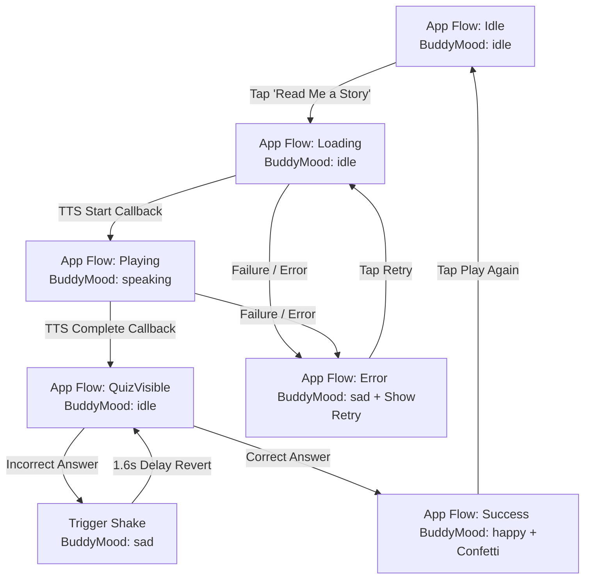

# Peblo - AI Story Buddy & Quiz Component

Peblo is a high-performance, production-quality, kid-friendly Flutter application for children aged 5–10, designed to improve reading comprehension. The app reads a story aloud, automatically transitions to a dynamic multiple-choice quiz loaded from a JSON configuration file, and celebrates correct answers with haptic vibrations, robot mood changes, and confetti.

---

## 🚀 Setup & Execution

### Prerequisites
* Flutter SDK (Latest Stable version, e.g. `>= 3.0.0`)
* Dart SDK (`>= 3.0.0 < 4.0.0`)
* Connected Android/iOS device or simulator.

### Setup Instructions
1. Navigate to the project root:
   ```bash
   cd c:\Users\rohit\OneDrive\Desktop\peblo_ai_story_buddy
   ```
2. Fetch required package packages:
   ```bash
   flutter pub get
   ```
3. Verify directory layout:
   Ensure the following assets exist:
   * `assets/data/quiz.json` (Quiz content)
   * `assets/images/robot_buddy.png` (Placeholder buddy image, if available)

### Run Instructions
* Run the application in standard debug mode:
   ```bash
   flutter run
   ```
* Run with performance profiling overlay enabled (highly recommended to verify 60 FPS target):
   ```bash
   flutter run --profile
   ```

---

## 🏗️ Architecture & Technology Stack

Peblo is structured using **Clean Architecture** patterns, separating components into distinct data, service, presentation, and utility layers to ensure modularity and scalability.

```
lib/
├── main.dart                      # Application initialization (ProviderScope)
├── models/
│   ├── quiz_model.dart            # Immutable Quiz data structure
│   └── app_state.dart             # Unified AppState, AppFlowStatus, and BuddyMood enums
├── services/
│   ├── tts_service.dart           # Speech synthesis interface and wrapper
│   └── quiz_repository.dart       # Load and parse quiz JSON data
├── providers/
│   ├── app_flow_provider.dart     # Unified application flow & state machine
│   └── quiz_repository_provider.dart # Repository dependency injection
├── screens/
│   └── story_screen.dart          # Main Single-Screen Orchestrator
├── widgets/
│   ├── buddy_character.dart       # Animated AI Buddy (Pip) with asset fallback
│   ├── story_card.dart            # Narrative display card with bold keywords
│   ├── quiz_panel.dart            # Dynamic option list with shake animation
│   └── confetti_celebration.dart  # Confetti controller wrapper
└── utils/
    ├── app_theme.dart             # Kid-friendly theme colors and typography
    └── haptic_feedback_helper.dart# Device vibration wrapper
```

### 1. Framework: Why Flutter Was Chosen
* **Consistent 60 FPS Rendering:** Flutter's Skia/Impeller graphics engine allows complex micro-animations (antenna glowing, robot blinking, bouncing, and confetti bursts) to run at 60 FPS even on mid-range Android devices.
* **Declarative Canvas Power:** Rebuilding the cute character programmatically using widgets, borders, and custom painters reduces memory utilization compared to loading heavy rasterized GIF/Lottie files.
* **Unified Control:** Easy integration of speech synthesis (`flutter_tts`) and system haptics alongside visual components in a single codebase.

### 2. State Management: Why Riverpod Was Chosen
* **Immutable State Modeling:** All states are represented as immutable classes (`AppState`), eliminating side-effects, race conditions, or unhandled data states.
* **Unified State Machine:** Rather than running separate change notifiers for audio, quiz, and errors, the entire flow is controlled by a unified state notifier (`AppFlowNotifier`).
* **Performance through Selective Listening:** Leverages Riverpod's `select` API (e.g. `ref.watch(appFlowProvider.select((s) => s.mood))`). This ensures that changes to the shake counter or selected answer do not cause the entire screen or unrelated widgets to rebuild.

---

## 🔄 App Flow & State Machine



### Audio Completion ➔ Quiz Transition
To keep the presentation layer completely decoupled from low-level audio callbacks:
1. `AppFlowNotifier` sets callbacks on the `TtsService`.
2. When the TTS Engine completes speaking, the callback runs and updates the global status:
   ```dart
   state = state.copyWith(status: AppFlowStatus.quizVisible, mood: BuddyMood.idle);
   ```
3. The UI automatically listens to this state shift. The `story_screen` detects `AppFlowStatus.quizVisible` and fades/slides the quiz panel into view.

---

## 📊 Data-Driven Dynamic Quiz Engine

The quiz is loaded dynamically from `assets/data/quiz.json` via the `QuizRepository` implementation:
* **Option Renderer:** The `QuizPanel` maps the array list `quiz.options` into option button widgets.
* **Zero Hardcoding:** No layout sizes or button states are hardcoded. It dynamically renders **3, 4, 5, or more options** out-of-the-box by wrapping them in a standard list, scaling vertically within the scroll view.
* **Robust Fallback:** If the JSON file is missing or fails to parse, the `AssetQuizRepository` falls back to a default hardcoded quiz object, preventing app crashes.

---

## 🛠️ Performance & Memory Optimizations (3GB RAM Target)

We implement several critical production-grade performance enhancements:

1. **Repaint Boundaries:**
   * High-frequency animations like the `BuddyCharacter` (floating/spinning) and `ConfettiCelebration` (bursting particles) run constantly during their respective states.
   * By wrapping these widgets in `RepaintBoundary`, they are isolated onto their own layers. Flutter does not paint the static background, story cards, or buttons during these animations.
2. **Selective Listening (`select`):**
   * Rebuild scopes in `StoryScreen` are minimized. Tapping an option or incrementing the shake counter does not rebuild the story header or story card.
3. **Const Constructors:**
   * Static elements (e.g. `StoryCard`, `AppBar`) are marked with `const` to allow compiler-level widget caching.
4. **Proper Resource Clean Up:**
   * The `TtsService` is disposed of cleanly via Riverpod's `ref.onDispose` to release system media channel allocations, preventing memory leaks on low-RAM devices.
5. **Asset Error Recovery:**
   * Image loading for the robot character is wrapped in an `errorBuilder` fallback. If the image asset is not found, the app automatically draws the vector character on canvas.

---

## 🧪 Error Handling & Audio Caching Strategies

### Error Handling Strategy
* All TTS calls and file loadings are wrapped in `try-catch` structures.
* Haptic feedback is captured safely to avoid crashing on devices/emulators that do not support physical vibration engines.
* Errors trigger `AppFlowStatus.error`, prompting the UI to display a kid-friendly error widget and a "Retry" button.

### Caching Strategy for Future Remote Audio
For future iterations where TTS or voice overs are downloaded from a remote URL:
1. **Package Dependency:** Integrate `flutter_cache_manager`.
2. **Narration Flow:**
   * Query the cache: `var file = await DefaultCacheManager().getSingleFile(audioUrl);`
   * If cached: Stream the local file.
   * If uncached: Download, cache, and play.
3. This reduces latency, saves bandwidth, and enables offline play.

---

## 🤖 AI Usage Disclosure
This project was developed with the assistance of Antigravity, an AI coding assistant. AI was used to design clean state architecture (Riverpod unified notifier), create custom UI vector styles, implement haptic-feedback helpers, write the shake animation triggers, and conduct performance optimization auditing.

# peblo-ai-story-buddy
Peblo Internship Challenge – A Flutter-based AI Story Buddy with TTS storytelling, interactive quizzes, Riverpod state management, and engaging child-friendly UI.
